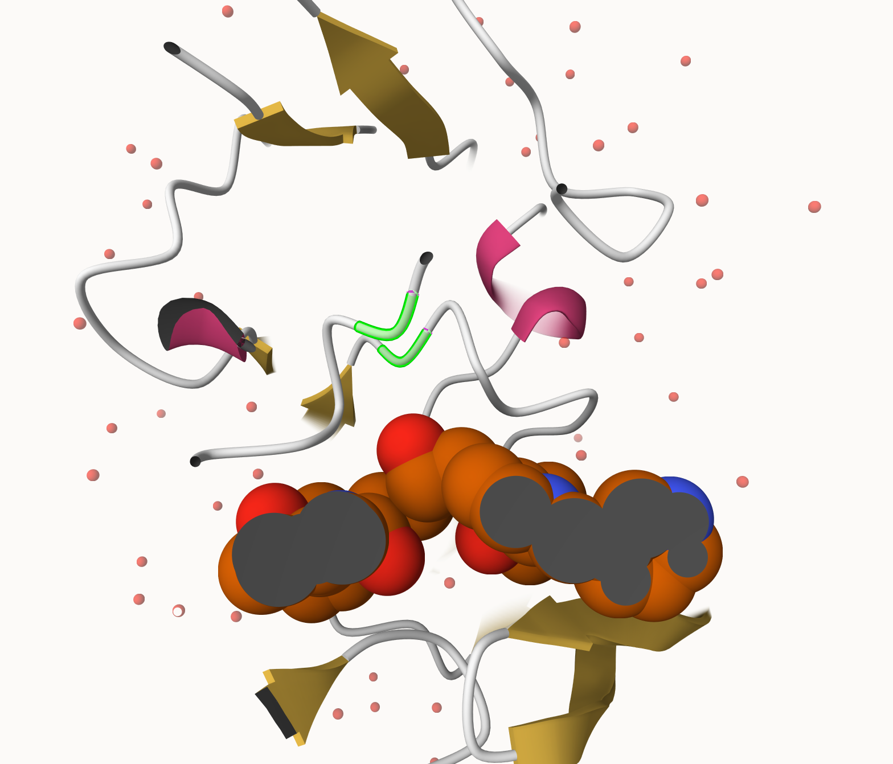

```{r}
csv <- read.csv("Data Export Summary.csv")
head(csv)
```

> Q1: What percentage of structures in the PDB are solved by X-Ray and Electron Microscopy.

249,018 total structures. 93.7892% are solved by xray and electron microscopy.


> Q2: What proportion of structures in the PDB are protein?

97.912% are protein.

> Q3: Type HIV in the PDB website search box on the home page and determine how many HIV-1 protease structures are in the current PDB?

1,173 structures.

> Q4: Water molecules normally have 3 atoms. Why do we see just one atom per water molecule in this structure?

We only see the Oxygen molecule, this is because protein crystal structures determined by x-ray crystallography measures electron density, and hydrogen atoms have very little.

> Q5: There is a critical “conserved” water molecule in the binding site. Can you identify this water molecule? What residue number does this water molecule have

Yes, HOH 308.

> Q6: Generate and save a figure clearly showing the two distinct chains of HIV-protease along with the ligand. You might also consider showing the catalytic residues ASP 25 in each chain and the critical water (we recommend “Ball & Stick” for these side-chains). Add this figure to your Quarto document.



```{r}
library(bio3d)
```

```{r}
pdb <- read.pdb("1hsg")
pdb
```

> Q7: How many amino acid residues are there in this pdb object?

198.

> Q8: Name one of the two non-protein residues? 

HOH or water.

> Q9: How many protein chains are in this structure? 

2 - A and B.

```{r}
adk <- read.pdb("6s36")
```

> Q10. Which of the packages above is found only on BioConductor and not CRAN?

msa.

> Q11. Which of the above packages is not found on BioConductor or CRAN?:

bio3dview.

> Q12. True or False? Functions from the pak package can be used to install packages from GitHub and BitBucket? 

True.

```{r}
library(bio3d)
aa <- get.seq("1ake_A")
aa
```

> Q13. How many amino acids are in this sequence, i.e. how long is this sequence? 

The sequence is 214 amino acids long.

> Q14. What do you note about this plot? Are the black and colored lines similar or different? Where do you think they differ most and why?

The are similar in most points and differ most in 2 big fluctuations. These 2 fluctuations probably represent the two nucleotide-binding site regions that can have different conformational states.
